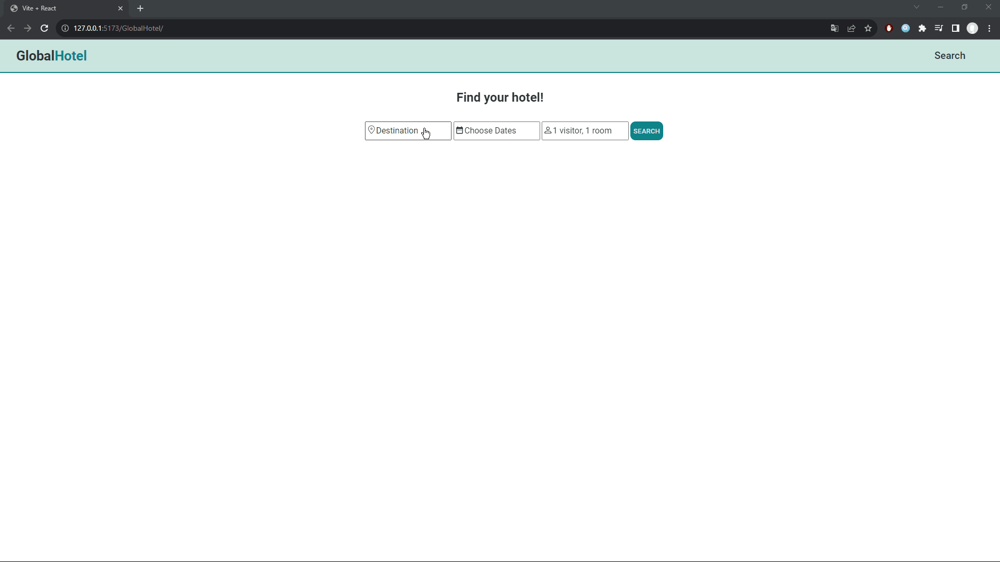

# GlobalHotel
A hotel search that gives you hotel options depending on destination, dates and number of people visiting. Upon clicking on hotel you can see the hotel photos and description. I used booking API. Keep in mind my that since I use free version the is a limit in API calls every month. 

Steps to get your own api key and maximize API calls every month:
1: Subscribe for free to booking api https://rapidapi.com/apidojo/api/booking/pricing
2. Find your key at https://rapidapi.com/apidojo/api/booking
3. Replace the keys in the search folder at DestModal.jsx, HotelDescription.jsx and ListProperties.jsx files.

# Technologies

The project was built in React js making use of html,css and javascript knowledge.

# What I learned and practiced 
- React js components, props
- Async functions (API fecthing)
- Redux toolkit (including useSelector and useDispatch)
- useContext
- useState, useEffect, useParams

